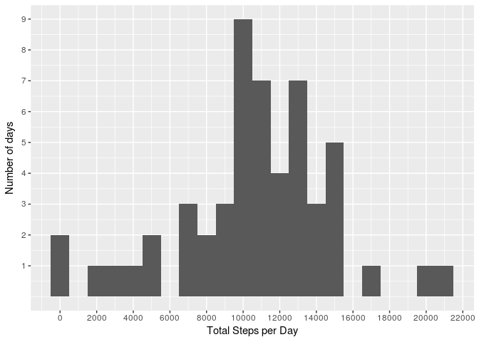
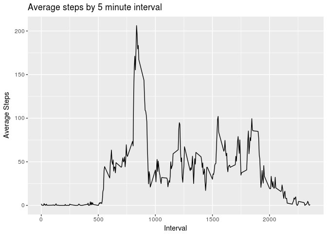
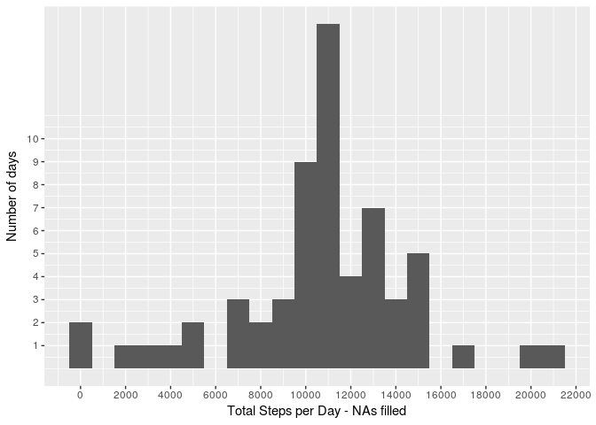
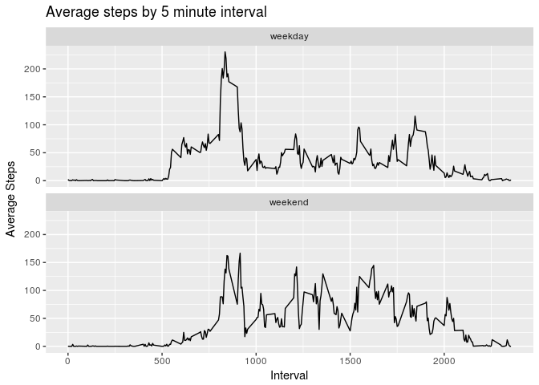

# PA1_template


### Introduction

This is an analysis of data from a personal activity monitoring device. This device collects data at 5 minute intervals through out the day. The data consists of two months of data from an anonymous individual collected during the months of October and November, 2012 and include the number of steps taken in 5 minute intervals each day.

Data was downloaded from Coursera Site https://d396qusza40orc.cloudfront.net/repdata%2Fdata%2Factivity.zip on 6/1/2017
File was unzipped into project directory prior to processing in R, and saved as activity.csv

### Step 1 Load Libraries, Read and Process Data

#### Load Libraries and Read Data with read.csv

```
## 
## Attaching package: 'dplyr'
```

```
## The following objects are masked from 'package:stats':
## 
##     filter, lag
```

```
## The following objects are masked from 'package:base':
## 
##     intersect, setdiff, setequal, union
```

```
## Loading required package: gsubfn
```

```
## Loading required package: proto
```

```
## Loading required package: RSQLite
```
#### Pre-process data

- Examine data with str
- Change "date"" field to data type of "date"


```r
str(activity)
```

```
## 'data.frame':	17568 obs. of  3 variables:
##  $ steps   : int  NA NA NA NA NA NA NA NA NA NA ...
##  $ date    : Factor w/ 61 levels "2012-10-01","2012-10-02",..: 1 1 1 1 1 1 1 1 1 1 ...
##  $ interval: int  0 5 10 15 20 25 30 35 40 45 ...
```

```r
activity$date <- as.Date(activity$date, "%Y-%m-%d")
str(activity)
```

```
## 'data.frame':	17568 obs. of  3 variables:
##  $ steps   : int  NA NA NA NA NA NA NA NA NA NA ...
##  $ date    : Date, format: "2012-10-01" "2012-10-01" ...
##  $ interval: int  0 5 10 15 20 25 30 35 40 45 ...
```
  
### Step 2 - Histogram of the total number of steps taken each day
  
####   Total by Date and examine new data frame  


```r
bydate <- group_by(activity, date) %>% summarize(total = sum(steps))
str(bydate)
```

```
## Classes 'tbl_df', 'tbl' and 'data.frame':	61 obs. of  2 variables:
##  $ date : Date, format: "2012-10-01" "2012-10-02" ...
##  $ total: int  NA 126 11352 12116 13294 15420 11015 NA 12811 9900 ...
```
  
#### Create Histogram  

```r
qplot(total, data=bydate, binwidth = 1000) +
      labs(x = "Total Steps per Day", y = "Number of days") +
      scale_y_continuous(breaks=seq(1:10)) +
      scale_x_continuous(breaks = pretty_breaks(10))
```

```
## Warning: Removed 8 rows containing non-finite values (stat_bin).
```

<!-- -->
  
### Step 3 - Calculate the mean and median number of steps taken per day
  
#### Use group by and summarize to create new data frame with mean and median steps per day

```r
meanmed <- activity %>% group_by(date) %>% summarize(mean.steps = mean(steps ), median.steps = median(steps, na.rm = TRUE)) 
```
  
#### Display mean and median  

```r
knitr::kable(meanmed, caption = "Mean and Median Number of Steps per Day", result="asis")
```


Table: Mean and Median Number of Steps per Day

date          mean.steps   median.steps
-----------  -----------  -------------
2012-10-01            NA             NA
2012-10-02     0.4375000              0
2012-10-03    39.4166667              0
2012-10-04    42.0694444              0
2012-10-05    46.1597222              0
2012-10-06    53.5416667              0
2012-10-07    38.2465278              0
2012-10-08            NA             NA
2012-10-09    44.4826389              0
2012-10-10    34.3750000              0
2012-10-11    35.7777778              0
2012-10-12    60.3541667              0
2012-10-13    43.1458333              0
2012-10-14    52.4236111              0
2012-10-15    35.2048611              0
2012-10-16    52.3750000              0
2012-10-17    46.7083333              0
2012-10-18    34.9166667              0
2012-10-19    41.0729167              0
2012-10-20    36.0937500              0
2012-10-21    30.6284722              0
2012-10-22    46.7361111              0
2012-10-23    30.9652778              0
2012-10-24    29.0104167              0
2012-10-25     8.6527778              0
2012-10-26    23.5347222              0
2012-10-27    35.1354167              0
2012-10-28    39.7847222              0
2012-10-29    17.4236111              0
2012-10-30    34.0937500              0
2012-10-31    53.5208333              0
2012-11-01            NA             NA
2012-11-02    36.8055556              0
2012-11-03    36.7048611              0
2012-11-04            NA             NA
2012-11-05    36.2465278              0
2012-11-06    28.9375000              0
2012-11-07    44.7326389              0
2012-11-08    11.1770833              0
2012-11-09            NA             NA
2012-11-10            NA             NA
2012-11-11    43.7777778              0
2012-11-12    37.3784722              0
2012-11-13    25.4722222              0
2012-11-14            NA             NA
2012-11-15     0.1423611              0
2012-11-16    18.8923611              0
2012-11-17    49.7881944              0
2012-11-18    52.4652778              0
2012-11-19    30.6979167              0
2012-11-20    15.5277778              0
2012-11-21    44.3993056              0
2012-11-22    70.9270833              0
2012-11-23    73.5902778              0
2012-11-24    50.2708333              0
2012-11-25    41.0902778              0
2012-11-26    38.7569444              0
2012-11-27    47.3819444              0
2012-11-28    35.3576389              0
2012-11-29    24.4687500              0
2012-11-30            NA             NA
  
Why are all median values 0?  Let's see how many observations are in each date and how many are 0?

```r
count <- sqldf('select date as date__Date, count(*) from activity where steps = 0 group by date', method = "name__class")
```

```
## Loading required package: tcltk
```

```
## Warning: Quoted identifiers should have class SQL, use DBI::SQL() if the
## caller performs the quoting.
```

```r
count0 <- sqldf('select date as date__Date, count(*) from activity group by date', method = "name__class")
ctable <- full_join(count0, count, by = "date")
names(ctable) <- c("date","total observations", "steps = 0 ")
```
  
Aha! Every date has more half its values as 0!

```r
knitr::kable(ctable, caption = "Total and 0 Values for each date", result="asis")
```


Table: Total and 0 Values for each date

date          total observations   steps = 0 
-----------  -------------------  -----------
2012-10-01                   288           NA
2012-10-02                   288          286
2012-10-03                   288          207
2012-10-04                   288          188
2012-10-05                   288          202
2012-10-06                   288          182
2012-10-07                   288          180
2012-10-08                   288           NA
2012-10-09                   288          193
2012-10-10                   288          184
2012-10-11                   288          213
2012-10-12                   288          177
2012-10-13                   288          184
2012-10-14                   288          194
2012-10-15                   288          211
2012-10-16                   288          192
2012-10-17                   288          200
2012-10-18                   288          222
2012-10-19                   288          195
2012-10-20                   288          205
2012-10-21                   288          197
2012-10-22                   288          201
2012-10-23                   288          200
2012-10-24                   288          208
2012-10-25                   288          244
2012-10-26                   288          200
2012-10-27                   288          213
2012-10-28                   288          184
2012-10-29                   288          226
2012-10-30                   288          199
2012-10-31                   288          202
2012-11-01                   288           NA
2012-11-02                   288          214
2012-11-03                   288          198
2012-11-04                   288           NA
2012-11-05                   288          214
2012-11-06                   288          205
2012-11-07                   288          193
2012-11-08                   288          236
2012-11-09                   288           NA
2012-11-10                   288           NA
2012-11-11                   288          193
2012-11-12                   288          219
2012-11-13                   288          207
2012-11-14                   288           NA
2012-11-15                   288          286
2012-11-16                   288          227
2012-11-17                   288          210
2012-11-18                   288          195
2012-11-19                   288          213
2012-11-20                   288          241
2012-11-21                   288          220
2012-11-22                   288          173
2012-11-23                   288          204
2012-11-24                   288          206
2012-11-25                   288          204
2012-11-26                   288          201
2012-11-27                   288          202
2012-11-28                   288          240
2012-11-29                   288          224
2012-11-30                   288           NA

### Step 4 - Time series plot of the average number of steps taken

#### Group data by interval and calculate the average number of steps for all days by interval


```r
byinterval <- group_by(activity, interval) %>%
      summarise(average = mean(steps, na.rm = TRUE))
```

#### Create time series plot with x axis as 5 minute intervals and y axis average number of steps taken across all days


```r
ggplot(data = byinterval) + 
      geom_line(aes(x = byinterval$interval, y = byinterval$average)) +
      labs(title = "Average steps by 5 minute interval") + 
      labs(x = "Interval", y = "Average Steps") 
```

<!-- -->

### Step 5 The 5-minute interval that, on average, contains the maximum number of steps
####Sort dataframe by steps descending to determine which 5 minute interval contains the maximum number of steps
Print the values of the 1st row of the sorted dataframe to show the interval and maximum number of steps


```r
byinterval <- arrange(byinterval, desc(average))
```

The interval with the maximum number steps is: 835 with 206.1698113 steps  

### Step 6 Code to describe and show a strategy for imputing missing data

#### Calcuate and Display the number of row with missing values (e.g, NAs)

```r
NAcount <- sum(is.na(activity$steps))
```
The number of rows with missing values is: 2304  

#### To fill in the missing values, use the mean values for each interval already calculated in the "byinterval" data frame

1. Use filter to create 2 dataframes 1 with rows containing NA, 1 with rows containing values
2. After filtering the NA frame, remove the steps column, as it will be replace
3. Join byinterval, to bring the average # of steps by interval into the dataframe for the NA rows
4. Reorder the columns and change the column name back to steps.  (The column was named 'average' in 'byinterval')
5. Combine the dataframe with the replace values for NAs back with the 2nd dataframe that had values for steps


```r
activityNA <- filter(activity, is.na(steps)) %>% select(-steps) 
activitynotNA <- filter(activity, !is.na(steps))
activityNA  <- left_join(activityNA, byinterval, by = "interval")
activityNA <-activityNA[c(3,1,2)]
colnames(activityNA)[1] <- "steps"
activityNAfill <- bind_rows(activityNA, activitynotNA)
```
#### As a simple check, show are the number of NAs

```r
NAcount <- sum(is.na(activityNAfill$steps))
```
The number of rows with missing values is: 0  
####,Compare the two data frames

```r
summary(activity)
```

```
##      steps             date               interval     
##  Min.   :  0.00   Min.   :2012-10-01   Min.   :   0.0  
##  1st Qu.:  0.00   1st Qu.:2012-10-16   1st Qu.: 588.8  
##  Median :  0.00   Median :2012-10-31   Median :1177.5  
##  Mean   : 37.38   Mean   :2012-10-31   Mean   :1177.5  
##  3rd Qu.: 12.00   3rd Qu.:2012-11-15   3rd Qu.:1766.2  
##  Max.   :806.00   Max.   :2012-11-30   Max.   :2355.0  
##  NA's   :2304
```

```r
summary(activityNAfill)
```

```
##      steps             date               interval     
##  Min.   :  0.00   Min.   :2012-10-01   Min.   :   0.0  
##  1st Qu.:  0.00   1st Qu.:2012-10-16   1st Qu.: 588.8  
##  Median :  0.00   Median :2012-10-31   Median :1177.5  
##  Mean   : 37.38   Mean   :2012-10-31   Mean   :1177.5  
##  3rd Qu.: 27.00   3rd Qu.:2012-11-15   3rd Qu.:1766.2  
##  Max.   :806.00   Max.   :2012-11-30   Max.   :2355.0
```
- Note that the summary values for date and interval are the same

### Step 7a Histogram of the total number of steps taken each day after missing values are imputed
Note - This section re-uses code from earlier sections, using a new dataframe bydateNAfill instead of bydate and meanmedNAfill instead of meanmed.  This requires modifying name of code chunks

#### Total by Date and examine new data frame  


```r
bydateNAfill <- group_by(activityNAfill, date) %>% summarize(total = sum(steps))
str(bydate)
```

```
## Classes 'tbl_df', 'tbl' and 'data.frame':	61 obs. of  2 variables:
##  $ date : Date, format: "2012-10-01" "2012-10-02" ...
##  $ total: int  NA 126 11352 12116 13294 15420 11015 NA 12811 9900 ...
```
  
#### Create Histogram  

```r
qplot(total, data=bydateNAfill, binwidth = 1000) +
      labs(x = "Total Steps per Day - NAs filled", y = "Number of days") +
      scale_y_continuous(breaks=seq(1:10)) +
      scale_x_continuous(breaks = pretty_breaks(10))
```

<!-- -->
  
### Step 7b - Calculate the mean and median number of steps taken per day
  
#### Use group by and summarize to create new data frame with mean and median steps per day


```r
meanmedNAfill <- activityNAfill %>% group_by(date) %>% summarize(mean.steps = mean(steps ), median.steps = median(steps)) 
```
  
####Display mean and median  

```r
knitr::kable(meanmedNAfill, caption = "Mean and Median Number of Steps per Day - NA's filled")
```


Table: Mean and Median Number of Steps per Day - NA's filled

date          mean.steps   median.steps
-----------  -----------  -------------
2012-10-01    37.3825996       34.11321
2012-10-02     0.4375000        0.00000
2012-10-03    39.4166667        0.00000
2012-10-04    42.0694444        0.00000
2012-10-05    46.1597222        0.00000
2012-10-06    53.5416667        0.00000
2012-10-07    38.2465278        0.00000
2012-10-08    37.3825996       34.11321
2012-10-09    44.4826389        0.00000
2012-10-10    34.3750000        0.00000
2012-10-11    35.7777778        0.00000
2012-10-12    60.3541667        0.00000
2012-10-13    43.1458333        0.00000
2012-10-14    52.4236111        0.00000
2012-10-15    35.2048611        0.00000
2012-10-16    52.3750000        0.00000
2012-10-17    46.7083333        0.00000
2012-10-18    34.9166667        0.00000
2012-10-19    41.0729167        0.00000
2012-10-20    36.0937500        0.00000
2012-10-21    30.6284722        0.00000
2012-10-22    46.7361111        0.00000
2012-10-23    30.9652778        0.00000
2012-10-24    29.0104167        0.00000
2012-10-25     8.6527778        0.00000
2012-10-26    23.5347222        0.00000
2012-10-27    35.1354167        0.00000
2012-10-28    39.7847222        0.00000
2012-10-29    17.4236111        0.00000
2012-10-30    34.0937500        0.00000
2012-10-31    53.5208333        0.00000
2012-11-01    37.3825996       34.11321
2012-11-02    36.8055556        0.00000
2012-11-03    36.7048611        0.00000
2012-11-04    37.3825996       34.11321
2012-11-05    36.2465278        0.00000
2012-11-06    28.9375000        0.00000
2012-11-07    44.7326389        0.00000
2012-11-08    11.1770833        0.00000
2012-11-09    37.3825996       34.11321
2012-11-10    37.3825996       34.11321
2012-11-11    43.7777778        0.00000
2012-11-12    37.3784722        0.00000
2012-11-13    25.4722222        0.00000
2012-11-14    37.3825996       34.11321
2012-11-15     0.1423611        0.00000
2012-11-16    18.8923611        0.00000
2012-11-17    49.7881944        0.00000
2012-11-18    52.4652778        0.00000
2012-11-19    30.6979167        0.00000
2012-11-20    15.5277778        0.00000
2012-11-21    44.3993056        0.00000
2012-11-22    70.9270833        0.00000
2012-11-23    73.5902778        0.00000
2012-11-24    50.2708333        0.00000
2012-11-25    41.0902778        0.00000
2012-11-26    38.7569444        0.00000
2012-11-27    47.3819444        0.00000
2012-11-28    35.3576389        0.00000
2012-11-29    24.4687500        0.00000
2012-11-30    37.3825996       34.11321

Impact of filling NAs increases total, mean and median in days containing NAs  
This can  be seen more clearly by comparing summaries of meanmed and meanmedNAfill


```r
knitr::kable(summary(meanmed), caption = "Summary of Means and Medians without NA's filled")
```


Table: Summary of Means and Medians without NA's filled

          date              mean.steps       median.steps 
---  -------------------  ----------------  --------------
     Min.   :2012-10-01   Min.   : 0.1424   Min.   :0     
     1st Qu.:2012-10-16   1st Qu.:30.6979   1st Qu.:0     
     Median :2012-10-31   Median :37.3785   Median :0     
     Mean   :2012-10-31   Mean   :37.3826   Mean   :0     
     3rd Qu.:2012-11-15   3rd Qu.:46.1597   3rd Qu.:0     
     Max.   :2012-11-30   Max.   :73.5903   Max.   :0     
     NA                   NA's   :8         NA's   :8     

```r
knitr::kable(summary(meanmedNAfill), caption = "Summary of Means and Medians with NA's filled")
```


Table: Summary of Means and Medians with NA's filled

          date              mean.steps       median.steps  
---  -------------------  ----------------  ---------------
     Min.   :2012-10-01   Min.   : 0.1424   Min.   : 0.000 
     1st Qu.:2012-10-16   1st Qu.:34.0938   1st Qu.: 0.000 
     Median :2012-10-31   Median :37.3826   Median : 0.000 
     Mean   :2012-10-31   Mean   :37.3826   Mean   : 4.474 
     3rd Qu.:2012-11-15   3rd Qu.:44.4826   3rd Qu.: 0.000 
     Max.   :2012-11-30   Max.   :73.5903   Max.   :34.113 

### Step 8 Panel plot comparing the average number of steps taken per 5-minute interval across weekdays and weekends
#### Create Create a new factor variable in the dataset with two levels – “weekday” and “weekend” indicating whether a given date is a weekday or weekend day. 

- Use the weekend function  
- Summarize and create average 


```r
actwday <- mutate(activityNAfill, daytype = as.factor(ifelse(weekdays(date, abbr = TRUE) %in% c("Sat", "Sun"), "weekend", "weekday")))
bydatew <- group_by(actwday, interval, daytype) %>% summarize(average = mean(steps)) %>% arrange(daytype)
```

#### Use ggplot with factor_grid to create Panel Plot

```r
ggplot(data = bydatew) + 
      geom_line(aes(x = interval, y = average)) +
      labs(title = "Average steps by 5 minute interval") + 
      labs(x = "Interval", y = "Average Steps") +
      facet_wrap(~daytype, nrow = 2)
```

<!-- -->
